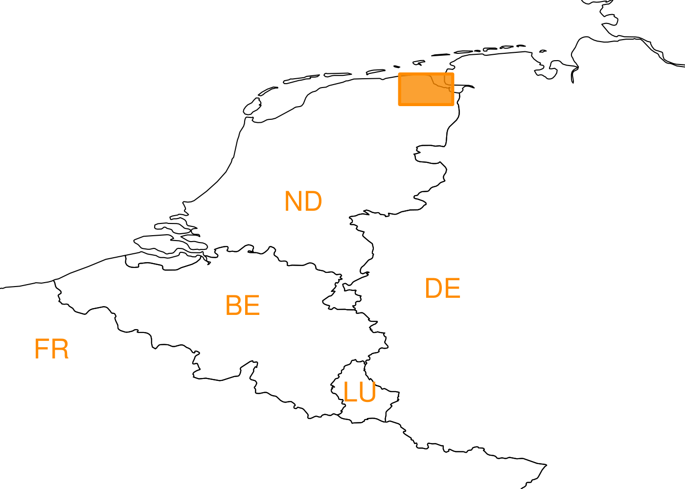

## Research Interests 

I am interested using statistical reasoning to better understand, explain and predict complex processes. I am particularly interested by problems relating to the environmental sciences or industrial applications. 

I develop models and inference procedures by drawing on a broad range of techniques from statistics and data science. Much of my work has centred around the use of stochastic point process models, Bayesian inference and extreme value theory.

## Statistical Consulting 

In addition to academic research I have experience working as a consultant statistician on a variety of industrial problems including inspection planning, predictive analytics and process optimisation.  

## PhD research
My research focused on developing statistical models to describe and understand earthquakes that are caused by gas extraction in the Netherlands. 

Human-induced earthquakes are usually smaller in magnitude and fewer in number than their tectonic counterparts. This low-data setting is a challenge to statistical modelling and necessitates the inclusion of domain-expert knowledge. If this low-data setting was not challenging enough, changes in gas extraction and earthquake detection lead to further complications and inefficiencies if standard modelling approaches are used.

My PhD research developed statistical methodology to make most efficient use of the limited available data and extended existing earthquake models to improve understanding of these induced seismic events. 

You can find a copy of my thesis on [github](https://github.com/zakvarty/varty_thesis_public). 

## Outputs

### Publications 
*Varty, Z.*, Tawn J.A., Atkinson P.M. and Bierman S. (2021). Inference for extreme earthquake mangitudes accounting for a time-varying measurement process. (preprint on [arXiv](https://arxiv.org/abs/2102.00884))

### Conference and workshop contributions

| Date      | Event | Location |
|-----------|:-----------------|------------------:|
| Jan 2021  | CRG Extremes workshop | Remote. |
| May 2020 | STOR-i time-series and spatial statistics workshop | Remote. | 
| Sept 2019 | Interfaces in extreme value theory workshop| Lancaster, UK. |
| Sept 2019 | Royal Statistical Society conference | Belfast, UK. |
| Aug  2019 | International statistical seismology workshop (StatSei11) | Hakone, JPN.|
| Jul 2019 | GRASPA (Italian Environmetrics Society)| Pescara, IT. |
| Jan 2019 | STOR-i annual conference | Lancaster, UK. |
| Jan 2018 | STOR-i annual conference | Lancaster, UK. |

## Past projects

_A review of simulated annealing techniques:_ Simulated annealing is a metahuristic technique mainly used for combinatorial optimisation. Applications, parallelisation and extensions of the technique were reviewed.

_Inference on censored networks:_ Networks are censored when existing nodes or edges are not observed. Methods for inference under different types of missingness were explored. Master's project supervised by Dr. Christopher Nemeth.

_Computionally intensive methods for modelling houshold epidemics:_
Approximate Bayesian Computation was utilised to allow inference on disease models with intractable likelihoods. Master's dissertation supervised by Prof. Peter Neal.

