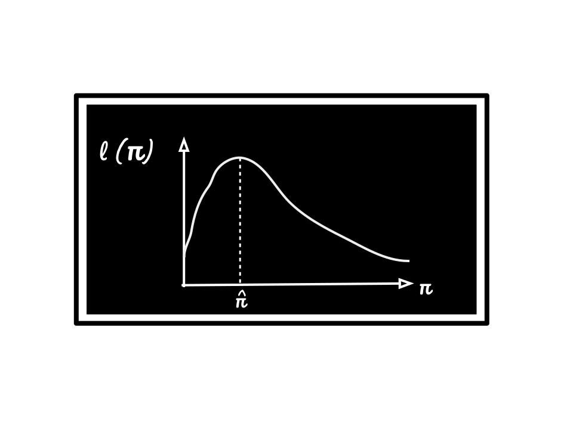

## Teaching Experience 

I am fortunate to have had the opportunity to teach in a variety of roles. These have included:

- one-to-one tuition for high school students;
- running workshops and computer labs for undergraduate and postgraduate modules;
- delivering short courses on scientific communication and LaTeX;
- cross-specialisation teaching of data ethics to chemistry research students;
- supervising undergraduate and postgraduate research projects; 
- lecturing postgraduate modules in statistics and data science.

I am an associate fellow of the Higher Education Academy, which you can learn more about [here](https://www.advance-he.ac.uk/fellowship/associate-fellowship)). I am currently working toward full fellowship to further develop my teaching practice. 

## Course History

### Imperial College London

| Year    | Course                    |    Role   |
|---------|:--------------------------|-----------:|
|2021-22  | Ethics in Data Science I  | Lecturer  |
|         | Supervised Learning       | Lecturer  |
|         | Data Ethics (Chemistry)   | Lecturer  |
|         | Ethics in Data Science II | Lecturer  |
|         | M1R: 1st year research project | Lecturer |

### Lancaster University

| Year    | Course                    |    Role   |
|---------|:--------------------------|-----------:|
|2020-21  | MATH562/582: Extreme Value Theory | Lecturer |
|         | MATH331: Bayesian Inference  | Graduate teaching assistant|
|         | MATH330: Likelihood Inference | Graduate teaching assistant|
| 2019-20 | DSCI485: Introduction to LaTeX   |	Co-leading short course|
|         | MATH566: Longitudinal Data Analysis | Graduate teaching assistant|
| 2018-19 |	STOR-i Internship: Introduction to LaTeX  |	Co-leading short course|
|         | DSCI485: Introduction to LaTeX   |	Co-leading short course|
|         | MATH562: Extreme Value Theory |	Graduate teaching assistant|
|         |	MATH235: Statistics II	| Graduate teaching assistant|
|         |	MATH240: Project Skills   |	Graduate teaching assistant|
|         |	MATH330: Likelihood Inference   |	Graduate teaching assistant|
|         |	MATH230: Probability II   |	Graduate teaching assistant|
| 2017-18 |	STOR-i Internship: Research Project |	Supervisor|
|         | STOR-i Internship: Introduction to LaTeX  |	Co-leading short course|
|         |	DSCI485: Introduction to LaTeX   |	Co-leading short course|
|         |	MATH235: Statistics II	   |Graduate teaching assistant|
|         |	MATH465: Bayesian Inference   |	Graduate teaching assistant|
|         |	MATH330: Likelihood Inference   |	Graduate teaching assistant|
|         |	MATH230: Probability II   |	Graduate teaching assistant|
| 2015-16 |	LAB100: Introduction to R   |	Graduate teaching assistant|
| 2011-13 | GCSE & A-level Mathematics | Private tutor |

